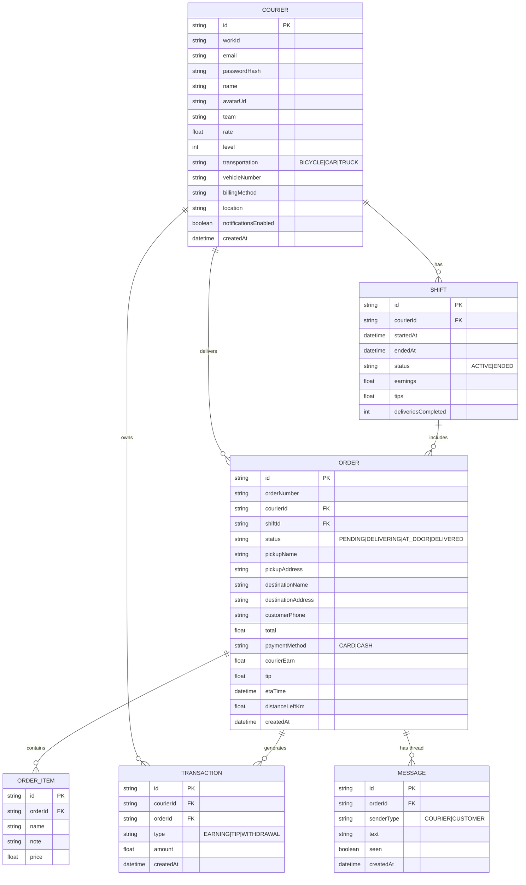

# ERD — Delivery Buddy

Paste this block into any Mermaid-compatible viewer (GitHub renders it natively in
markdown). Entity names below are shown in PascalCase for readability in the diagram.
The live schema is defined in `backend/src/db/init.sql` using PostgreSQL with
snake_case table and column names (`couriers`, `work_id`, `courier_id`, etc.).

## Notes on cardinality decisions
- **Shift → Order** is one-to-many: an order is assigned within a single shift,
  but a courier's full order history spans many shifts.
- **Transaction.orderId is nullable**: withdrawals aren't tied to an order.
- **Order status is a strict state machine**, enforced in the route handlers, not
  just the DB: `PENDING → DELIVERING → AT_DOOR → DELIVERED`.
- **Courier settings** (`billingMethod`, `location`, `notificationsEnabled`) are
  stored on the `couriers` table — no separate settings table.
- Level/rate on COURIER are stored, not computed — the "level raised due to high
  activity" banner implies a background rule (e.g. deliveries-completed threshold)
  updates it; simplest implementation is a check on shift-stop, bump level if
  weekly deliveries > threshold.
